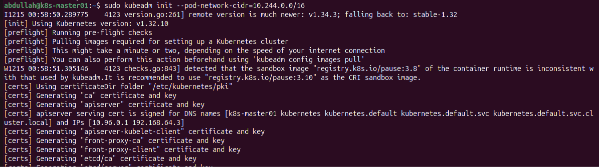
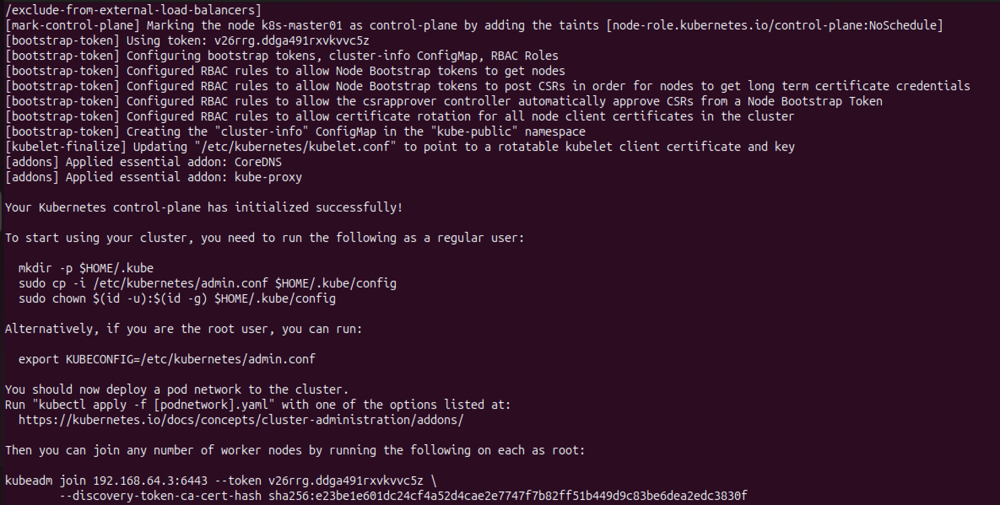
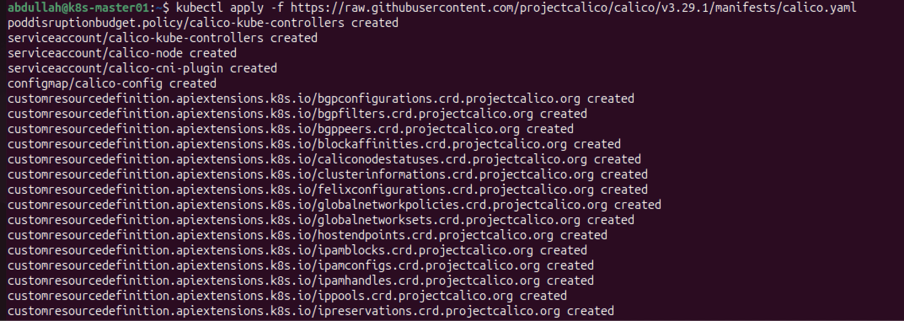

# Task 1: Single Node Kubernetes Production Cluster Setup (v1.32)

This document details the exact steps I took to provision and configure a single-node Kubernetes cluster using `kubeadm` version 1.32 on Ubuntu.

## 1. System Configuration

First, I set the hostname to `k8s-master01` and refreshed the shell session.
```bash
sudo hostnamectl set-hostname "k8s-master01" && exec bash
````

I checked the IP address of the node.

```bash
hostname -I
```


I added the node's IP mapping to the `/etc/hosts` file.

```bash
sudo nano /etc/hosts
# Added the line: 192.168.64.3 k8s-master01
```


Then, I updated the system packages and rebooted the server.

```bash
sudo apt update && sudo apt upgrade -y
sudo reboot
```

## 2\. Disabling Swap

I disabled swap immediately and then edited the `fstab` file to make the change persistent across reboots.

```bash
sudo swapoff -a
sudo sed -i '/ swap / s/^\(.*\)$/#\1/g' /etc/fstab
```

I verified that swap was completely disabled.

```bash
swapon --show
```


## 3\. Kernel Modules and Networking

I loaded the required kernel modules for Kubernetes (`overlay` and `br_netfilter`).

```bash
sudo modprobe overlay
sudo modprobe br_netfilter
```

I added these modules to the load configuration so they persist after reboot.

```bash
sudo tee /etc/modules-load.d/k8s.conf << EOF
overlay
br_netfilter
EOF
```

I configured the networking parameters to allow bridged traffic and IP forwarding.

```bash
sudo tee /etc/sysctl.d/k8s.conf << EOF
net.bridge.bridge-nf-call-iptables = 1
net.bridge.bridge-nf-call-ip6tables = 1
net.ipv4.ip_forward = 1
EOF
```

I applied these system settings without rebooting.

```bash
sudo sysctl --system
```


## 4\. Installing Container Runtime (Containerd)

I installed `containerd` as the container runtime.

```bash
sudo apt install -y containerd
```

I created the configuration directory and generated the default configuration file.

```bash
sudo mkdir -p /etc/containerd
sudo containerd config default | sudo tee /etc/containerd/config.toml
```


I updated the configuration to use `systemd` as the Cgroup driver (required for Kubernetes 1.32).

```bash
sudo sed -i 's/SystemdCgroup = false/SystemdCgroup = true/' /etc/containerd/config.toml
```

Finally, I restarted and enabled the `containerd` service.

```bash
sudo systemctl restart containerd
sudo systemctl enable containerd
```


## 5\. Installing Kubernetes Components

I installed the necessary packages to securely download the Kubernetes repository key.

```bash
sudo apt-get update
sudo apt-get install -y apt-transport-https ca-certificates curl gpg
```

I created the directory for the keyrings and downloaded the Kubernetes public signing key.

```bash
sudo mkdir -p /etc/apt/keyrings
curl -fsSL [https://pkgs.k8s.io/core:/stable:/v1.32/deb/Release.key](https://pkgs.k8s.io/core:/stable:/v1.32/deb/Release.key) | sudo gpg --dearmor -o /etc/apt/keyrings/kubernetes-apt-keyring.gpg
```


I added the Kubernetes v1.32 repository to my sources list.

```bash
echo 'deb [signed-by=/etc/apt/keyrings/kubernetes-apt-keyring.gpg] [https://pkgs.k8s.io/core:/stable:/v1.32/deb/](https://pkgs.k8s.io/core:/stable:/v1.32/deb/) /' | sudo tee /etc/apt/sources.list.d/kubernetes.list
```


I updated the package index and installed `kubelet`, `kubeadm`, and `kubectl` (version 1.32).

```bash
sudo apt-get update
sudo apt-get install -y kubelet=1.32.* kubeadm=1.32.* kubectl=1.32.*
```

I marked these packages on "hold" to prevent them from being automatically upgraded.

```bash
sudo apt-mark hold kubelet kubeadm kubectl
```


## 6\. Initializing the Cluster

I initialized the control plane using `kubeadm`, specifying the pod network CIDR required by Calico.

```bash
sudo kubeadm init --pod-network-cidr=10.244.0.0/16
```



To start using the cluster, I set up the `kubeconfig` file for my user account.

```bash
mkdir -p $HOME/.kube
sudo cp -i /etc/kubernetes/admin.conf $HOME/.kube/config
sudo chown $(id -u):$(id -g) $HOME/.kube/config
```


I verified the node status.

```bash
kubectl get nodes
```


## 7\. Installing Network Plugin

I installed the Calico network plugin to handle pod networking.

```bash
kubectl apply -f [https://raw.githubusercontent.com/projectcalico/calico/v3.29.1/manifests/calico.yaml]
```


## 8\. Verification

I checked the node status again to ensure it was `Ready`.

```bash
kubectl get nodes
```


