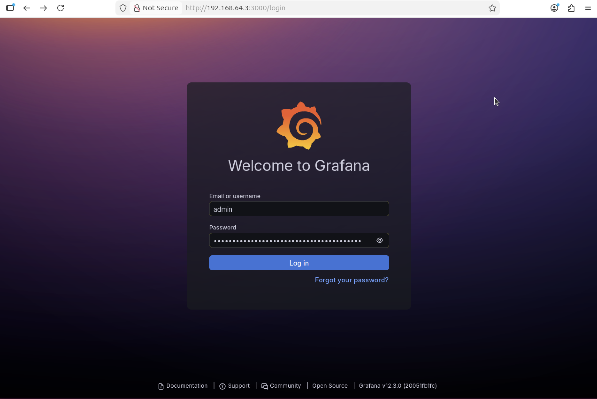
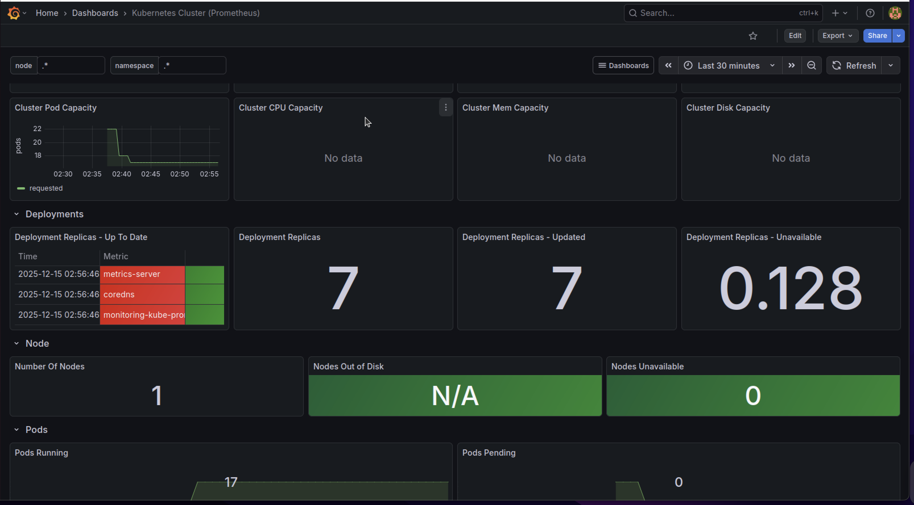
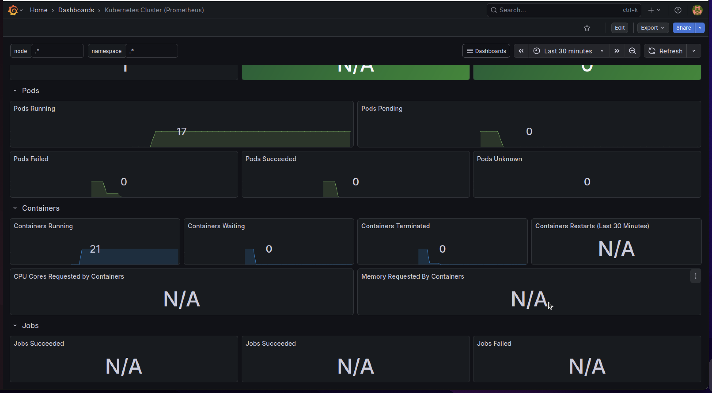

# Task 2: Cluster Configuration, Ingress, and Observability

In this task, I transformed the bare-bones Kubernetes cluster created in Task 1 into a fully functional environment capable of hosting applications and monitoring its own health. I used **Helm** (the Kubernetes package manager) to install the necessary tools as specified in the assignment requirements.

Below are the detailed steps I took to configure the cluster and the reasoning behind each configuration.

## 1. Enabling Workloads

**The Reason:** By default, the control plane node has a "taint" that prevents user applications from running on it. Since I am working with a single-node cluster, I had to remove this restriction to allow the Ingress and Monitoring pods to run.

**The Step:**
```bash
kubectl taint nodes --all node-role.kubernetes.io/control-plane-
````


## 2\. Installing Package Manager (Helm)

**The Reason:** The assignment required installing multiple complex tools (Ingress, Monitoring). Helm simplifies this process by managing dependencies and configurations automatically, acting like an "App Store" for Kubernetes.

**The Step:**

```bash
sudo snap install helm --classic
```


## 3\. Configuring Ingress Controller

**The Goal:** Configure a controller to route external traffic to internal services.
**The Solution:** I installed the **Nginx Ingress Controller** using Helm. The assignment specifically required it to be configured as a `DaemonSet`, ensuring it runs on every node in the cluster. I also configured the service type as `NodePort`.

**The Steps:**

```bash
helm install ingress-nginx ingress-nginx/ingress-nginx \
  --set controller.kind=DaemonSet \
  --set controller.service.type=NodePort \
  --namespace ingress-nginx --create-namespace
```


## 4\. Configuring Metrics Server

**The Goal:** Enable resource monitoring (CPU/RAM usage) for the cluster.
**The Solution:** I installed the Kubernetes Metrics Server. I added the `--kubelet-insecure-tls` flag because my student cluster uses self-signed certificates; without this flag, the metrics server would fail to validate the connection.

**The Steps:**

```bash
helm repo add metrics-server [https://kubernetes-sigs.github.io/metrics-server/](https://kubernetes-sigs.github.io/metrics-server/)
helm repo update

helm install metrics-server metrics-server/metrics-server \
  --set args={--kubelet-insecure-tls} \
  --namespace kube-system
```


## 5\. Configuring Monitoring Stack (Prometheus & Grafana)

**The Goal:** Implement full-stack observability.
**The Solution:** I installed the **Kube Prometheus Stack**. This is an industry-standard collection that installs Prometheus (for metrics collection) and Grafana (for visualization) together in a single step.

**The Steps:**

```bash
# 1. Added the repository
helm repo add prometheus-community [https://prometheus-community.github.io/helm-charts](https://prometheus-community.github.io/helm-charts)

# 2. Installed the stack
helm install monitoring prometheus-community/kube-prometheus-stack \
  --namespace monitoring --create-namespace
```


## 6\. Verification
I verified if all all the pods are running using 
````bash
kubeclt get pods -A
````


## 7\. Dashboard Import

**The Goal:** Visualize the cluster metrics using a dashboard.
**The Solution:** After verifying all pods were in the `Running` state using `kubectl get pods -A`, I accessed the Grafana UI and imported an official dashboard.

**The Steps:**

1.  **Accessing Grafana:** I used port-forwarding to make the Grafana service accessible on port 8080.

    ```bash
    kubectl port-forward svc/monitoring-grafana 8080:80 -n monitoring --address 0.0.0.0
    ```
    

2.  **Accessing Login Screen:**

      I accessed the dashboard at `http://192.168.64.3:3000/login`.
      

3.  **Accessing Login Credentials:**

      I stopped port forwarding to get the password to login.
      ````bash
        kubectl get secret --namespace monitoring monitoring-grafana -o jsonpath="{.data.admin-password}" | base64 --decode ; echo
      ````
      

      After getting the passowrd i re-ran the command for port forwarding and logged in successfully.
      
      

3.  **Importing the Dashboard:**

      * I navigated to **Home \> Dashboards \> Import Dashboard**.
      

      * I used Dashboard ID **315** (Kubernetes Cluster Monitoring) and **6417** (Kubernetes Cluster (Prometheus)) to create 2 dashboards.
      * I selected **Prometheus** as the data source in both the dashboards and loaded the dashboards to view the graphs.
      
      
      

