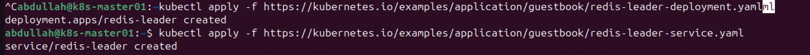
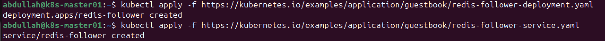
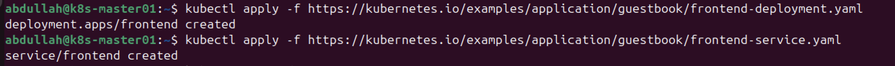
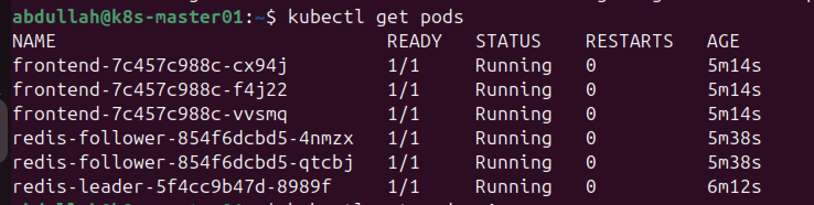
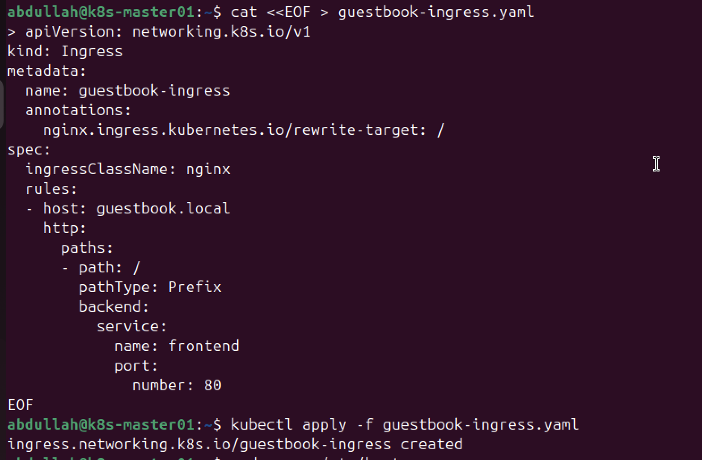
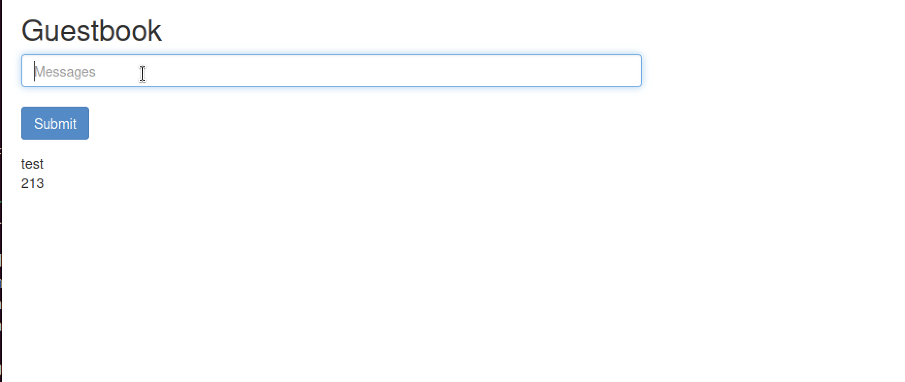

# Task 3: Deploying a Stateless Application (Guestbook) with Ingress

In this task, I deployed the official Kubernetes "Guestbook" application. This is a multi-tier web application that demonstrates how to connect a frontend (PHP) to a backend database (Redis) and expose the service to the outside world using the Ingress Controller configured in Task 2.

## 1. Application Architecture

The Guestbook application consists of three main components:
1.  **Redis Leader:** Handles database write operations.
2.  **Redis Followers:** Replicated instances that handle database read operations (for scaling).
3.  **Frontend:** A PHP-based web UI that reads from and writes to the Redis database.

## 2. Deploying the Database (Redis)

I followed the official Kubernetes documentation to deploy the database tier.

**Step 1: Deploying the Redis Leader**
I applied the deployment and service for the Redis write-master.
```bash
kubectl apply -f https://kubernetes.io/examples/application/guestbook/redis-leader-deployment.yaml
````
````bash
kubectl apply -f https://kubernetes.io/examples/application/guestbook/redis-leader-service.yaml
````



**Step 2: Deploying the Redis Followers**
I deployed the follower instances to handle read traffic. This demonstrates the master-slave replication pattern in Kubernetes.

```bash
kubectl apply -f https://kubernetes.io/examples/application/guestbook/redis-follower-deployment.yaml
````
````bash
kubectl apply -f https://kubernetes.io/examples/application/guestbook/redis-follower-service.yaml
````


## 3\. Deploying the Frontend

Next, I deployed the web frontend. Since I previously removed the taint from my control plane node (in Task 2), these pods were able to schedule and run on my single-node cluster without issues.

```bash
kubectl apply -f https://kubernetes.io/examples/application/guestbook/frontend-deployment.yaml
````
````bash
kubectl apply -f https://kubernetes.io/examples/application/guestbook/frontend-service.yaml
````


I verified that all pods were running before proceeding:

```bash
kubectl get pods
# Output showed: frontend, redis-leader, and redis-follower pods in 'Running' state.
```


## 4\. Exposing the Application via Ingress

**The Challenge:** The official tutorial suggests using `LoadBalancer` or `NodePort` to expose the frontend. However, the assignment requirements specifically asked to use **Ingress**.

**The Solution:** I created a custom Ingress resource (`guestbook-ingress.yaml`) to route traffic from the hostname `guestbook.local` to the frontend service on port 80.

**The Configuration:**

```yaml
apiVersion: networking.k8s.io/v1
kind: Ingress
metadata:
  name: guestbook-ingress
  annotations:
    nginx.ingress.kubernetes.io/rewrite-target: /
spec:
  ingressClassName: nginx
  rules:
  - host: guestbook.local
    http:
      paths:
      - path: /
        pathType: Prefix
        backend:
          service:
            name: frontend
            port:
              number: 80
```

**Applying the Configuration:**

```bash
kubectl apply -f guestbook-ingress.yaml
```



## 5\. Verification

Since I do not have a real DNS server for `guestbook.local`, I verified the deployment using following method:

I edited my local hosts file (`/etc/hosts`) to map `192.168.64.3` to `guestbook.local`. I was then able to open `http://guestbook.local` in my browser and successfully submit entries to the Guestbook.

