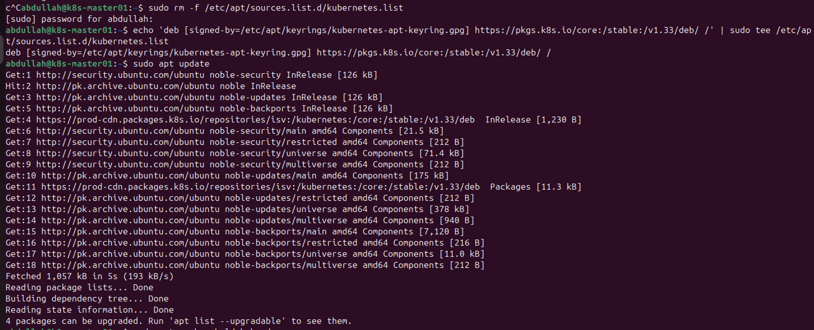
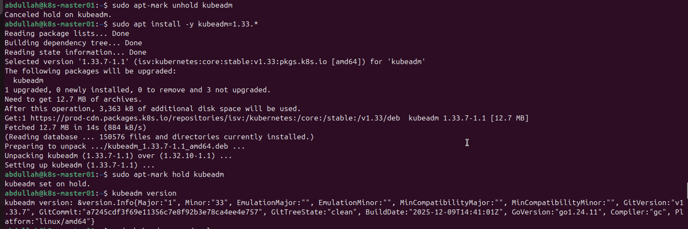
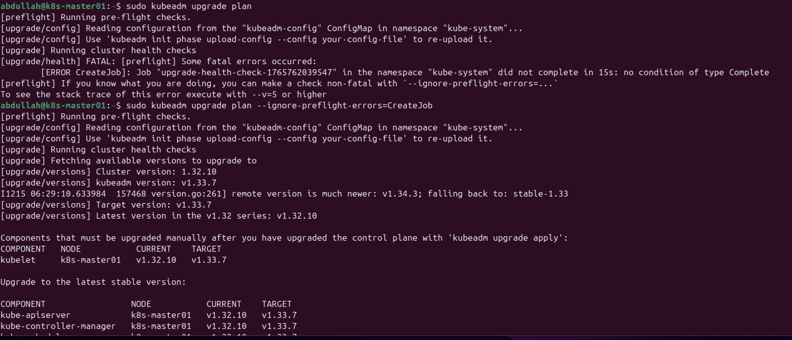
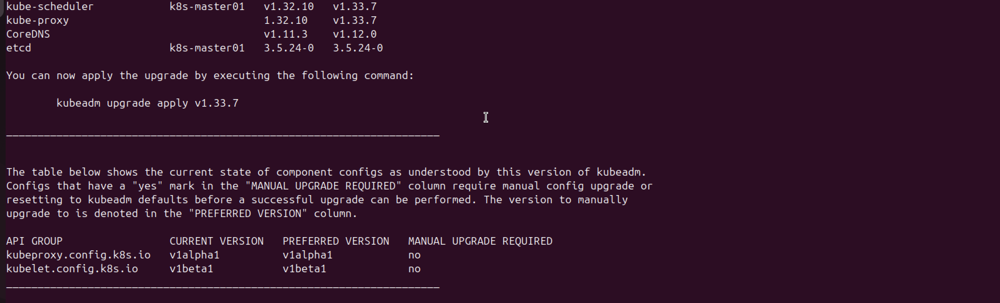
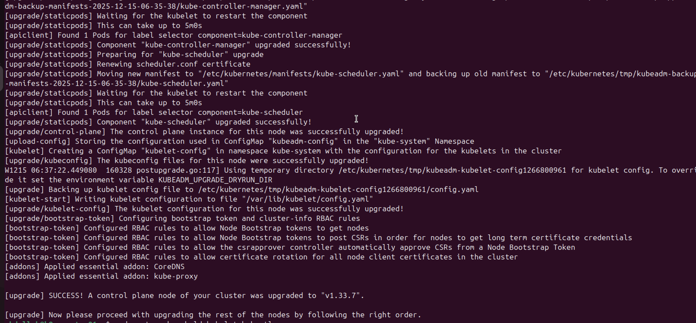
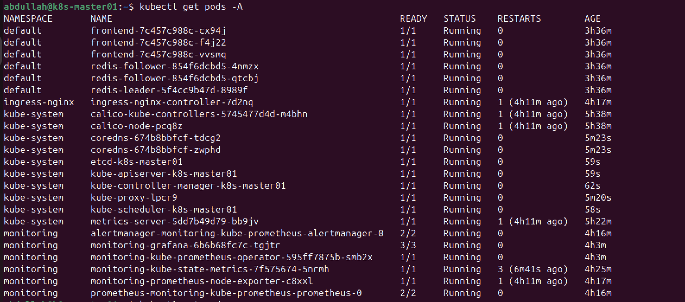

# Task 4: Cluster Upgrade (v1.32 to v1.33)

In this final task, I performed an in-place upgrade of the Kubernetes cluster from version **1.32** to **1.33**. This process involved upgrading the control plane components (`kubeadm`, API Server, Controller Manager) and the node components (`kubelet`, `kubectl`) while ensuring existing workloads (the Guestbook application) remained active.

## 1. Preparation and Repository Update

**The Goal:** Switch the package source to the v1.33 repository.

**The Steps:**
I removed the old v1.32 repository configuration and added the official v1.33 source to `apt`.

```bash
# 1. Remove old list
sudo rm -f /etc/apt/sources.list.d/kubernetes.list

# 2. Add v1.33 repository
echo 'deb [signed-by=/etc/apt/keyrings/kubernetes-apt-keyring.gpg] [https://pkgs.k8s.io/core:/stable:/v1.33/deb/](https://pkgs.k8s.io/core:/stable:/v1.33/deb/) /' | sudo tee /etc/apt/sources.list.d/kubernetes.list

# 3. Update apt
sudo apt update
````


## 2\. Upgrading the Upgrade Tool (kubeadm)

**The Goal:** Upgrade the `kubeadm` binary, which orchestrates the cluster upgrade.

**The Steps:**
I unheld the package, installed the latest v1.33 version, and verified the installation.

```bash
sudo apt-mark unhold kubeadm
sudo apt install -y kubeadm=1.33.*
sudo apt-mark hold kubeadm

# Verified version: v1.33.7
kubeadm version
```


## 3\. Upgrading the Control Plane

**The Goal:** Upgrade the core Kubernetes components (API Server, etcd, Scheduler).

**The Challenge:** During the pre-flight checks, `kubeadm upgrade plan` failed with a fatal error: `[ERROR CreateJob]: Job ... did not complete in 15s`. This is a common issue in resource-constrained VM environments where the health check pod takes slightly too long to start.

**The Solution:** I used the `--ignore-preflight-errors=CreateJob` flag to bypass this strict timeout check, knowing the cluster was otherwise healthy.

**The Steps:**

```bash
# 1. Checked the plan (ignoring the timeout error)
sudo kubeadm upgrade plan --ignore-preflight-errors=CreateJob
````



````bash
# 2. Applied the upgrade
sudo kubeadm upgrade apply v1.33.7 --etcd-upgrade=false --ignore-preflight-errors=CreateJob
````



*Result:* The upgrade completed successfully, and the control plane components were updated to v1.33.7.

## 4\. Upgrading Node Components (Kubelet & Kubectl)

**The Goal:** Upgrade the node agent (`kubelet`) and command-line tool (`kubectl`) to match the control plane version.

**The Steps:**

```bash
# 1. Install new versions
sudo apt-mark unhold kubelet kubectl
sudo apt-get update
sudo apt-get install -y kubelet=1.33.* kubectl=1.33.*
sudo apt-mark hold kubelet kubectl

# 2. Restart services to apply changes
sudo systemctl daemon-reload
sudo systemctl daemon-reexec
sudo systemctl restart kubelet
```


## 5\. Verification

**The Goal:** Confirm the node is running the new version and the Guestbook application is still active (as per requirements).

**Step 1: Check Node Version**

```bash
kubectl get nodes
```


The version column confirms the node is now running **v1.33.7**. The "Age" column confirms it is the same node (not a fresh install).

**Step 2: Check Workloads**

```bash
kubectl get pods
```


*Result:* The Guestbook pods (`frontend`, `redis-leader`, `redis-follower`) were listed as `Running`. This confirms the upgrade was non-destructive and the existing deployment was preserved.
